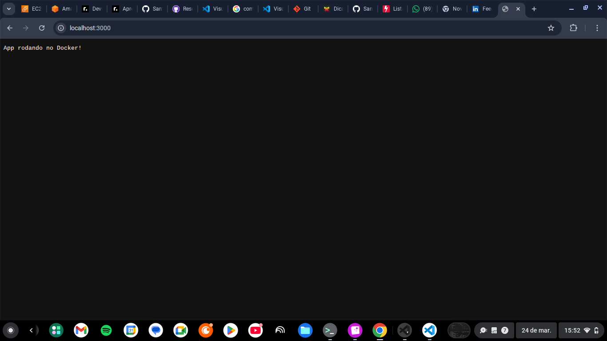

# 🚀 Projeto Git + CI/CD + Docker
>Simulaçao prática de um fluxo DevOps real, do commit ao deploy automatizado com CI/CD e Docker.


## 🚀 Sobre o projeto

Este projeto documenta, de forma prática, minha evolução no uso de Git, GitHub, CI/CD com GitHub Actions e Docker, simulando um fluxo real de desenvolvimento utilizado em times de tecnologia.

## 🚀 Objetivo do Projeto

Aplicar na prática:
- Controle de versão com Git
- Estratégias de branching (main, feature, fix)
- Resolução de conflitos
- Uso de rebase para histórico limpo
- CI/CD com GitHub Actions
- Containerização com Docker 

---

## 🛠️ Ferramentas utilizadas
 
- 🐧 Linux (ambiente de desenvolvimento)
- 🌿 Git (controle de versão)
- 💻 GitHub (repositório remoto)
- ⚙️ GitHub Actions (CI/CD)
- 🐳 Docker (containerização)
- 🚀  Node.js

---
## 📁 Estrutura do projeto

```plaintext
.
├── app/
│   ├── index.js
│   └── package.json
├── assets/
│   ├── app.png
│   └── pipeline.png
├── docker/
│   └── Dockerfile
├── scripts/
└── README.md
```

###  👤 Configurando do Git  
Definição  das credenciais globais do Git
   
```bash
git config --global user.name "Seu Nome"
git config --global user.email "seu-email@exemplo.com"
```

---

###  📁 Criando o repositório
Criação de um novo repositório local

```bash
mkdir meu-repo
git init
```
----
###  📄 Criação do README
Criação do arquivo principal do projeto

```bash 
touch README.md
vim README.md
``` 

### ➕ Adicionando arquivo ao Git
```bash
git add README.md
```

---

###  💾 Adicionando o primeiro commit

```bash
git commit -m "feat: Inicialização do projeto Git com README estruturado"
```

---

### 🔍 Verificando o status e histórico

```bash
git status
git log 
```

---

## 🌿 Trabalhando com Branches

- main ➡️ código principal
- feature/* ➡️ novas funcionalidades
- fix/* ➡️ correções

---

### 🌿  Criando uma nova branch
Criação de uma branch para desenvolvimento isolado.

```bash
git checkout -b feature/login
```

---

### 🔀 Merge
Integração de alterações entre branches

```bash
git merge feature/login
```

---

### ⚠️ Resolvendo confitos de Merge

Este cenário simula conflitos reais comuns em equipes de desenvolvimento, demonstrando na prática como identificar e resolver conflitos durante o merge.

```bash
git merge nova-branch
```
após resolver conflito manualmente: 

```bash
git add .
git commit
```
---

### 🔄 Rebase básico

Reaplicando commits da branch atual sobre a brach main, mantendo um histórico linear.

```bash
git checkout -b feature/rebase-teste
git rebase main 
```

---

### 🐛 Correção de Bug

Utilizado para correções rápidas no projeto.

```bash
git checkout -b fix:README
```
---

### 🔄 Reset e Restore

Aplicado para desfazer alterações e testar cenários.

```bash
git restore README.md
git reset --hard HEAD~1
``` 

---
## 📦 Configurando .gitignore

Utilizado para ignorar arquivos desnecessários no  versionamento, como dependência, arquivos temporários e credenciais.

```bash
touch .gitignore
git add .gitignore
git push -u origin main
```
---
### 🔗 Conectando ao GitHub

```bash
git remote add origin https://github.com/SantRhay/Projeto-Git
git branch -M main
git push -u origin main
``` 

---

# 🔄 CI/CD Pipeline

## 🔄 Integrão Continuna

Este projeto aplica conceitos de CI (Continuos Intengration), garantindo que cada alteração no código seja validada automaticamente.

Isso reduz erros, melhora a qualidade de código e simula práticas reais de time DevOps.

### ✔️ O pipeline executa:

- Validação automática do projeto
- Simulação de testes
- Verificação de arquivos essenciais
- Build Docker
- Execução do container
- Teste via HTTP

📌 Executando a cada push na branch main

## ⚙️ Detalhes do Pipeline 

Arquivio: `.github/workflows/ci.yml`

### Etapas:
- Checkout do código
- Validação do projeto
- Execução de teste simulados
- Testes
- Build da aplicação
- Criação da imagem Docker
- Execução do container
- Teste de aplicação via curl

---

 ## 🚀  Demonstração de Pipeline


---

## 🐳 Docker 

### 📦 Containerização

Este projeto utiliza Doker para gatantir um ambiente consistente de execução da aplicação.

### 🧱 Dockerfile

A aplicação é buildada utilizando um Dockerfile baseado em Node.js:

```dockerfile
FROM node:18

WORKDIR /app

COPY app/package*.json ./
RUN npm install

COPY app/ .

EXPOSE 3000

CMD ["node", "index.js"]
```

### ▶️ Build da imagem

```bash
docker build -t projeto-git -f docker/Dockerfile .
```

### 🚀 Execução do container

```bash
docker run -d -p --name app-docker 3000:3000 projeto-git
```
### 🧪 Teste automatizado

Validação da aplicação após subir o container:

```bash
curl http://localhost:3000
```

### 🌐 Acessar Aplicação no navegador
```bash
http://localhost:3000
```

---


## 🚀 Aplicação

### 📌 Descrição

Aplicação simples em node.js que simula um servidor HTTP executando dentro de um container Docker, permitindo validar o funcionamento da containerização na prática.

---

### ⚙️ Funcionamento

- Cria um servidor HTTP
- Escuta na porta 3000
- Retorna uma mensagem simples no navegador

---

### 📄 Codigo principal

```javascript
const http = require ('http');

const server = http.createServer ((req, res) => {
    res.end('App rodando no Docker!');
});

server.listen (3000, () => {
    console.log ('Servidor rodando na porta 3000');
});
```

## Evidência de Execução

### 🌐 Aplicação rodando

A aplicação foi executada com sucesso dentro de um container Docker.



### ⚙️ Container em execução

Verificando containers ativos:

```bash
docker ps
```

---

```md
# 📊 Resultados

- Fluxo completo com Git aplicado
- Integração com GitHub
- Pipelice CI/CD funcional
- Containerização com Docker
- Simulação de ambiente real desenvolvimento
```


## 🧠 Aprendizados Técnicos

Durante este projeto, desenvolvi conhecimentos práticos em:

- Uso prático do Git no dia a dia
- Criação e gerenciamento de branches
- Resolução de conflitos de merge
- Uso de git rebase
- Automação com GitHub Actions
- Containerização com Docker

---

## 📌 Conclusão

Este projeto demonstra, na prática, a aplicação de conceitos fundamentais de DevOps, incluindo versionamento, automação e containerização.

A estrutura simula um fluxo real de desenvolvimento utilizado em ambientes profissionais.

---

## 👤 Autora

**Rayane Santana**

🚀 Em transição para área de tecnologia | DevOps

🔗 LinkedIn: https://www.linkedin.com/in/rayane-santana-dev/