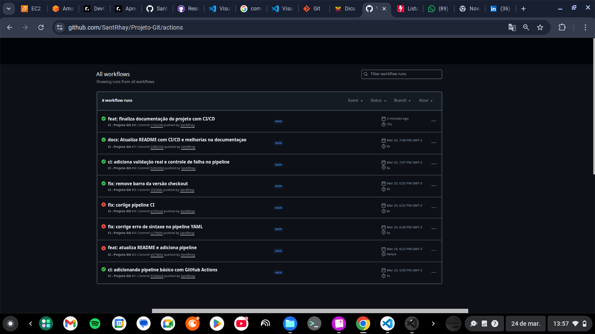

# 🚀 Projeto Git - Controle de Versionamento

> 🚀 Projeto prático focado em simular cenários reais de versionamento utilizando Git e GitHub.


## 🚀  Demonstração de Pipeline




## 📌 Navegação

- [📌 Sobre o projeto](#-sobre-o-projeto)
- [🛠️ Ferramentas](#️-ferramentas-utilizadas)
- [⚙️ Comandos](#️-comandos-utilizados)
- [🔄 Pipeline CI/CD](#-pipeline-cicd)
- [🧪 Prática](#-o-que-foi-praticado)
- [📚 Aprendizados](#-aprendizados)

---

# 📌  Sobre o Projeto

## 🧩 Contexto

Este projeto simula um ambiente real de desenvolvimento, aplicando práticas utilizadas em times DevOps profissinais.

O objetivo é consolidar conhecimento em versionamento e integração contínuna por meio de cenários praticos.

---
## 📂 Estrutura do Projeto

```bash
.
├── .github/workflows/
├── assets/
├── README.md
└── scripts/
```

---

## 🛠️ Ferramentas utilizadas
 
- 🐧 Linux (ambiente de desenvolvimento)
- 🌿 Git (controle de versão)
- 💻 GitHub (repositório remoto)
- ⚙️ GitHub Actions (CI/CD)

---

## ⚙️ Comando Utilizados

### 👤 Configurando o usuário  
Definição  das credenciais globais do Git
   
```bash
git config --global user.name "Rayane Santana"
git config --global user.email "seu-email@exemplo.com"
```

---

### 📁 Criando o repositório
Criação de um novo repositório local

```bash
mkdir meu-repo
git init
```
### 📄 Criando do arquivo README
Criação do arquivo principal do projeto

```bash 
touch README.md
```

### ✏️ Editando o arquivo

```bash
vim README.md
``` 

### ➕ Adicionando ao stage


```bash
git add README.md
```

---


### 💾 Adicionando o primeiro commit

```bash
git commit -m "feat: Inicialização do projeto Git com README estruturado"
```

---

### 📊 Verificando o status

```bash
git status
``` 
---

### 📜 Verifcando Histórico

```bash
git log 
```

---

## 🌿 Fluxo Git (BRANCH/ MERGE/ REBASE)

## 🌿 Estratégia de Branches

- main ➡️ código principal
- feature/* ➡️ novas funcionalidades
- fix/* ➡️ correções

Criei uma nova branch para desenvolver uma feature isolada do código principal.

```bash
git checkout -b nova-branch
```
---

# 🔗 Repositório Remoto do GitHub

```bash
git remote add origin https://github.com/SantRhay/Projeto-Git
git branch -M main
git push -u origin main
``` 
---

# ⚠️ Resolvendo confitos de merge

Este cenário simula conflitos reais comuns em equipes de desenvolvimentos

```bash
git merge nova-branch
```
---

# 🔄 Teste de reset

```bash
git restore README.md
git reset --hard HEAD~1
``` 
---

# 📦 Configurando .gitignore

```bash
touch .gitignore
git add .gitignore
git push -u origin main
```
---

# 🚀 Comandos utilizados

### 🌿  Criando uma nova branch
Criação de uma branch para desenvolvimento isolado

```bash
git checkout -b feature/login
```

### 🔀 Merge
Integração de alterações entre branches

```bash
git merge nova-branch
```

### 🔄 Rebase básico
Reorganização do histórico de commits

```bash
git checkout -b feature/rebase-teste
git rebase main 
```

---

### 🐛 Correção de Bug

Criando uma nova branch:  

```bash
git checkout -b fix:README
```
---

### ⚠️ Simulação de conflito em merge

Criando a branch:
  
```bash
git checkout -b conflito-teste
```
---

### 🌿 Criando um Rebase básico

Criando a branch:

```bash
git checkout -b feature/rebase-teste
``` 

---

# 🔄 CI/CD Pipeline

## 🔄 Integrão Continuna

Este projeto aplica conceitos de CI (Continuos Intengration), garantindo que cada alteração no código seja validada automaticamente.

Isso reduz erros, melhora a qualidade de código e simula práticas reais de time DevOps.

### ✔️ O pipeline executa:

- Validação automática do projeto
- Simulação de testes
- Verificação de arquivos essenciais
- Execução a cada push na branch main

📌 Resultado:
- Feedback imediato
- Garantia de qualidade
- Simulação de ambiente DevOps real

## ⚙️ Detalhes do Pipeline 

Arquivio: `.github/workflows/ci.yml`

### Etapas:
- Checkout do código
- Validação do projeto
- Execução de teste simulados
- Verificação de integridade

Pipeline executando automaticamente a cada push na branch 'main'.

---

# Como executar 

```bash
git clone https://github.com/SantRhay/Projeto-Git.git

cd Projeto-Git
```
 
## 🧠 Aprendizados Técnicos

- Uso prático do Git no dia a dia
- Criação e gerenciamento de branches
- Resolução de conflitos de merge
- Uso de git rebase
- Automação com GitHub Actions

---

## 📌 Conclusão

Este projeto foi essencial para consolidar meus conhecimentos em Git e controle de versionamento, permitindo aplicar na prática conceitos como criação de branches, resolução de conflitos e gerenciamento de histórico;

Simulei cenários reais de desenvolvimento, aplicando práticas utilizadas no mercado e fortalecendo minha base em versionamento e CI/CD

---

## 📊 Resultados

- Pipeline CI/CD funcional com GitHub Actions
- Automatização de validações a cada push
- Simulação de fluxo real de desenvoltimento
- Aplicação de boas práticas de versionamento

## 👤 Autora

Feito por **Rayane Santana**
💻 Em transição para área de tecnologia / DevOps

LinkedIn: https://www.linkedin.com/in/rayane-santana-dev/